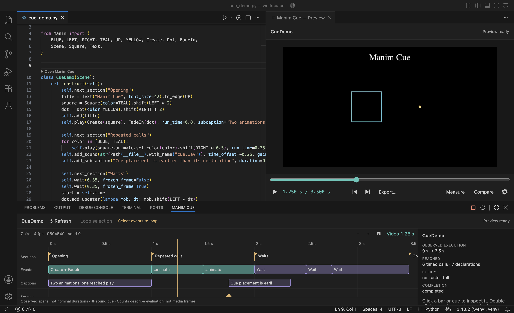

# Manim Cue

Manim Cue adds a live preview and execution timeline for Manim scenes to VS Code.
It helps you inspect a scene while you edit instead of repeatedly switching to a
terminal and video player.



- See the selected frame soon after saving.
- Scrub and play the finished preview.
- Inspect animations, waits, sections, captions, and sound cues on a timeline.
- Jump from a timeline event to its Python source.
- Compare two captured frames with a wipe or opacity overlay.
- Measure coordinates and distances in a fixed 2D camera frame.
- Save frames, preview videos, timeline data, or a new MP4 render.

## Get started

You need desktop VS Code 1.96+, the Microsoft Python extension, Python 3.11+, and Git.

> [!IMPORTANT]
> **Manim Cue requires a preview version of Manim.** Install the upstream
> `refactor/manager-targeted-frame` branch in your project environment with **uv**:
>
> ```sh
> uv add "manim @ git+https://github.com/ManimCommunity/manim.git@refactor/manager-targeted-frame"
> ```
>
> Or activate your virtual environment and use **pip**:
>
> ```sh
> pip install --upgrade "manim @ git+https://github.com/ManimCommunity/manim.git@refactor/manager-targeted-frame"
> ```
>
> Manim may also need [system packages](https://docs.manim.community/en/stable/installation.html)
> for Cairo, text rendering, and video encoding. The preview branch may identify itself
> as version `0.21.0`, so Cue checks its available features rather than its version number.

1. Find **Manim Cue** in the Extensions view and choose **Install Pre-Release Version**.
   You can also install a downloaded VSIX with **Extensions → … → Install from VSIX…**.
2. Open the folder containing your scene and trust the workspace.
3. Run **Python: Select Interpreter** and choose the environment where you installed Manim.
4. Run **Manim Cue: Check Python Environment**. The result should say **Ready**.
5. Open a saved Python file containing a `Scene` class.
6. Click **▶ Open Manim Cue** above the class, or run **Manim Cue: Open Scene**.

You can try the included `examples/cue_demo.py` scene first.

## Everyday use

Save your scene to update the selected frame and timeline. The previous image remains
visible with an **OLD PREVIEW** label until the update is ready.

Use the scrubber or timeline to choose a time. Press **Space** to play or pause and
**Left/Right** to step by one frame while the preview is focused. Select timeline events
and turn on **Loop selection** to repeat that part of the scene.

The controls above the preview provide the main tools:

- **Export…** saves the current frame, preview video, timeline JSON, or a new MP4 render.
- **Compare** pins a frame, then shows later frames with a wipe or opacity overlay.
- **Measure** shows Manim coordinates and measures distances.
- The **settings cog** opens preview width, frame rate, and automatic video settings.

Preview playback is muted. Sound cues still appear on the timeline and exported renders
include scene audio. Measurement is intended for a centred, unrotated 2D camera.

Your scene runs as normal Python code with your user account's file, network, and process
access. Only run scenes and plugins you trust.

## Learn more

- [Using the preview, timeline, export, comparison, and measurement tools](docs/usage.md)
- [Choosing Python and solving common problems](docs/troubleshooting.md)
- [Improving preview performance and clearing caches](docs/performance.md)
- [How scene updates work](docs/architecture.md)
- [Development and tests](docs/development.md)

[Third-party notices](THIRD_PARTY_NOTICES.md) · [License](LICENSE)
